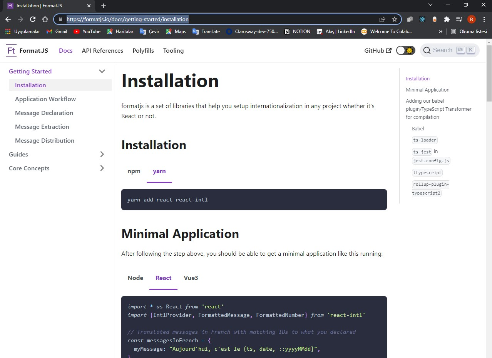
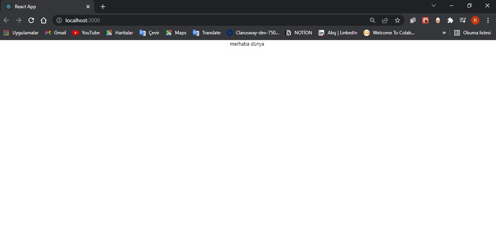

# react-localization

bu bölümde react ile localization işlemlerini nasıl yapabileceğimizi öğrenmeye çalışacağız.çoklu dille alakalı çalışmaları nasıl yönete biliriz. kullanacağımız kütüphanenin ismi react intel bunun kurulumunu yapacağız sonra da kullanmaya başlayacağız.
projemizi ayağa kaldıralım

Id CommandLine
  -- -----------
   1 git clone https://github.com/SenFaruk/react-localization.git
   2 cd .\react-localization\
   3 npx create-react-app localization
   4 cd localization
   5 npm start

   

## https://formatjs.io/docs/getting-started/installation

 sitesine gidip docs installation kısmı

 ## 

 ## yarn add react react-intl

 diyerek kurulumu başlatıyorum.

 dökümana döndüğüm zaman burada react-intl import etmiş bunun altında üç tane
 <import {IntlProvider, FormattedMessage, FormattedNumber} from 'react-intl'>
 component var bu componentleri kullanarak kuruluma başlaya biliyoruz hemen bizde bu import işlemini yapalım.App.js te ihtiyacım olmayan kısımları kaldırdım.
 docs baktığımızda <IntlProvider > denen bir component var bu component ile diğer componentleri sarmallamış içeride <FormattedMessage> diye bir tanım var bunun çalışa bilmesi için <IntlProvider > ihtiyaç var buradan data sağlanıyor mesala burada message prop unda sizin kullanacağınız messajlar tanımları vereceksiniz ve bu data altaki componentlere sağlanacak sonrada onların üzerinde gerekli çevirim işlemini yapacak..

 <IntlProvider > componentini alalım ve messages objesini tanımlayalım sonra messages prop unu  <IntlProvider > componentine veriyorum.
 beni istediğim şey buradaki title göstermek <FormattedMessage> adında bir tanım var bu tanımı kullanarak bu işlemleri yapa biliyoruz <FormattedMessage>
bir id vermeliyim.id ne olmalı bu objenin(messages) içindeki hangi key (title)
igöstermek istiyorsam o olmalı burada title var title i buraya verdim

## App.js

import logo from "./logo.svg";
import "./App.css";

import { IntlProvider, FormattedMessage, FormattedNumber } from "react-intl";

function App() {
  const messages = {
    title: "merhaba dünya",
  };
  return (
    

      <IntlProvider messages={messages}>
        <FormattedMessage id="title" />
      </IntlProvider>
    

  );
}

export default App;

## 
