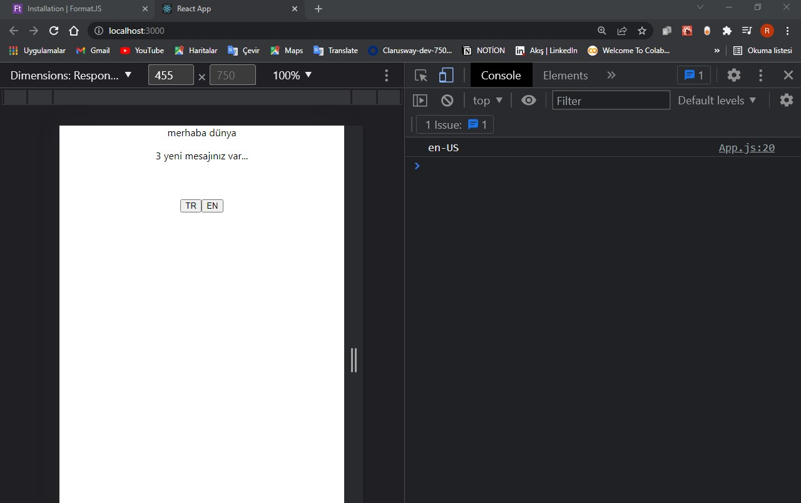

# react-localization

bu bölümde react ile localization işlemlerini nasıl yapabileceğimizi öğrenmeye çalışacağız.çoklu dille alakalı çalışmaları nasıl yönete biliriz. kullanacağımız kütüphanenin ismi react intel bunun kurulumunu yapacağız sonra da kullanmaya başlayacağız.
projemizi ayağa kaldıralım

Id CommandLine
  -- -----------
   1 git clone https://github.com/SenFaruk/react-localization.git
   2 cd .\react-localization\
   3 npx create-react-app localization
   4 cd localization
   5 npm start

   

## https://formatjs.io/docs/getting-started/installation

 sitesine gidip docs installation kısmı

 ## 

 ## yarn add react react-intl

 diyerek kurulumu başlatıyorum.

 dökümana döndüğüm zaman burada react-intl import etmiş bunun altında üç tane
 <import {IntlProvider, FormattedMessage, FormattedNumber} from 'react-intl'>
 component var bu componentleri kullanarak kuruluma başlaya biliyoruz hemen bizde bu import işlemini yapalım.App.js te ihtiyacım olmayan kısımları kaldırdım.
 docs baktığımızda <IntlProvider > denen bir component var bu component ile diğer componentleri sarmallamış içeride <FormattedMessage> diye bir tanım var bunun çalışa bilmesi için <IntlProvider > ihtiyaç var buradan data sağlanıyor mesala burada message prop unda sizin kullanacağınız messajlar tanımları vereceksiniz ve bu data altaki componentlere sağlanacak sonrada onların üzerinde gerekli çevirim işlemini yapacak..

 <IntlProvider > componentini alalım ve messages objesini tanımlayalım sonra messages prop unu  <IntlProvider > componentine veriyorum.
 beni istediğim şey buradaki title göstermek <FormattedMessage> adında bir tanım var bu tanımı kullanarak bu işlemleri yapa biliyoruz <FormattedMessage>
bir id vermeliyim.id ne olmalı bu objenin(messages) içindeki hangi key (title)
igöstermek istiyorsam o olmalı burada title var title i buraya verdim

## App.js

import logo from "./logo.svg";
import "./App.css";

import { IntlProvider, FormattedMessage, FormattedNumber } from "react-intl";

function App() {
  const messages = {
    title: "merhaba dünya",
  };
  return (
    

      <IntlProvider messages={messages}>
        <FormattedMessage id="title" />
      </IntlProvider>
    

  );
}

export default App;

## 

-_-_-_-_-_-_-_-_-_ React Intl-kurulum -_-_-_-_-_-_-_-_-_

peki burada ingilizceyide eklersek nasıl yapacağız şöyleki:
hemen aşağıda iki button ekleyelim.
birinde tr diğerinde ingilizceye geçiş yapmayı sağlayalım.
react ide import edelim elimizde bir state timiz olsun. bu state aktif dil hangisi ise onu tutsun.useState diyelim sonra ona atama yapacak fonksiyonu tanımlıyorum. varsayılan olarak ta <"tr-TR> verelim. sonra tr buttonuna tıklandığında  dili <tr-Tr>
olarak değiştirsin diğerinde ise ingilizce olarak değiştirsin. <const messages = {
    title: "merhaba dünya",
  };> bu messages objesine birde ingilizce tanımını eklemem lazım o yüzden bunu biracık değiştireceğiz
  <"tr-TR"> ve <"en-US"> objemiz olacak bunları dorduracağız.

  ## App.js

  import "./App.css";

import { IntlProvider, FormattedMessage, FormattedNumber } from "react-intl";
import { useState } from "react";

const messages = {
  "tr-TR": {
    title: "merhaba dünya",
  },
  "en-US": {
    title: "hello world",
  },
};
function App() {
  const [lang, setLang] = useState("tr-TR");

  return (
    

      <IntlProvider messages={messages}>
        <FormattedMessage id="title" />
      </IntlProvider>
       
       
      <button onClick={() => setLang("tr-TR")}>TR</button>
      <button onClick={() => setLang("en-US")}>EN</button>
    

  );
}

export default App;

## 

ekranda görüldüğü üzere title yazıyor yani <FormattedMessage id="title" /> buradaki id ne ise onu yazdı. bunun sabebi, <IntlProvider messages={messages}> buradaki messages kısmında hangi objeyi vereceksek onu kullanmalıyız. gerekli düzeltmeleri yapalım

<IntlProvider messages={messages["tr-TR"]}> diye düzeltirsem türkçe
<IntlProvider messages={messages["en-US"]}> diye düzeltirsem ingilizce olacak.
ozaman ben burada state timi kullanmalıyım:
<IntlProvider messages={messages[lang]}> dersem varsayılan olarak türçe gösterecek <EN> tuşuna basınca ingilizceye dönecektir.
şimdi messages değişkenine birde description key i ekleyelim.

tagları içinde de description ları göstereyim.

## App.js

import "./App.css";

import { IntlProvider, FormattedMessage, FormattedNumber } from "react-intl";
import { useState } from "react";

const messages = {
  "tr-TR": {
    title: "merhaba dünya",
    description: " 3 yeni mesajınız var...",
  },
  "en-US": {
    title: "hello world",
    description: " you have 3 new messages...",
  },
};
function App() {
  const [lang, setLang] = useState("tr-TR");

  return (
    

      <IntlProvider messages={messages[lang]}>
        <FormattedMessage id="title" />
        

          {" "}
          <FormattedMessage id="description" />
        

      </IntlProvider>
       
       
      <button onClick={() => setLang("tr-TR")}>TR</button>
      <button onClick={() => setLang("en-US")}>EN</button>
    

  );
}

export default App;
## 
## 

böylelikle yeni key içinde dil tanımını eklemiş oldum.
react-Intl ile çalışmaya başlamamız dereken ihiyaçlar bunlar idi.
öncelikle <IntlProvider /> ı en dışa koyacağız sonrada içerisine kullanmak istediğiniz her hangibir yazıdır, paragraftır neyse arttık 
onuda <FormattedMessage  /> componentine id olarak verdiğinizde kullanmaya başlaya bilirsiniz

-_-_-_-_-_-_-_-_-_ Default Locale -_-_-_-_-_-_-_-_-_

web sayfamızı ilk açtığımızda bizi varsayılan dil karşılıyor. biz tr belirlediğimiz için tr başlatılıyor. oysa kullandığımız browserın dili ne ise onunla açılmalı idi.şimdi bunu düzeltelim.Ayrıca en kısmına geçtikten sonra sayfayı yenilediğimde tekrar tr oluyor.bu iki problemi düzeltelim. kaynak koduma geliyorum öncelikle browserın dilini öğrenmem lazım <const defaultLocale = navigator.language;> tanımın kullanabilirim şimdi bunu console.log(defaultLocale); diyerek kontrol edelim.

## 

en-US şeklinde verdi. fakat burada bir uyarı var.locale tanımı yapılmamış bunu <<IntlProvider messages={messages[lang]}>>buraya yapalım ve hata kodlarımızı aşağıdaki gibi düzeltelim

## App.js
import "./App.css";

import { IntlProvider, FormattedMessage, FormattedNumber } from "react-intl";
import { useState } from "react";

const messages = {
  "tr-TR": {
    title: "merhaba dünya",
    description: " 3 yeni mesajınız var...",
  },
  "en-US": {
    title: "hello world",
    description: " you have 3 new messages...",
  },
};
function App() {
  const defaultLocale = navigator.language;
  const [locale, setLocale] = useState("tr-TR");

  console.log(defaultLocale);

  return (
    

      <IntlProvider locale={locale} messages={messages[locale]}>
        <FormattedMessage id="title" />
        

          {" "}
          <FormattedMessage id="description" />
        

      </IntlProvider>
       
       
      <button onClick={() => setLocale("tr-TR")}>TR</button>
      <button onClick={() => setLocale("en-US")}>EN</button>
    

  );
}

export default App;
## 

ekranda görüldüğü gibi varsayılan türkçe ama browserın dili ingilizce.

<const defaultLocale = navigator.language;>  <defaultLocale> değişkenimi  statetime koyarsam durum düzelecektir <const [locale, setLocale] = useState(defaultLocale);> 

## App.js

import "./App.css";

import { IntlProvider, FormattedMessage, FormattedNumber } from "react-intl";
import { useState } from "react";

const messages = {
  "tr-TR": {
    title: "merhaba dünya",
    description: " 3 yeni mesajınız var...",
  },
  "en-US": {
    title: "hello world",
    description: " you have 3 new messages...",
  },
};
function App() {
  const defaultLocale = navigator.language;
  const [locale, setLocale] = useState(defaultLocale);

  console.log(defaultLocale);

  return (
    

      <IntlProvider locale={locale} messages={messages[locale]}>
        <FormattedMessage id="title" />
        

          {" "}
          <FormattedMessage id="description" />
        

      </IntlProvider>
       
       
      <button onClick={() => setLocale("tr-TR")}>TR</button>
      <button onClick={() => setLocale("en-US")}>EN</button>
    

  );
}

export default App;

## 

şu anda dili türkçe seçip refresh yaparsam tekrar ingilizce oluyor.çünkü default yani browserın dili ingilizce olduğu için ingilizce açılıyor.halbuki en son tercih hangisi ise onunla açılmasını istiyorum. o yüzdende şöyle birşey yapacağız. bir dil değişimi olduğunda bunu local store e yazacağız.ve sonraki kullanımlardada local store de de eğer bir dil tanımı varsa oradan kullanmasını zorlayacağız yoksada navigator altındaki nesneyi kullanmaya çalışacağız.
   oyüzden ben burada useEffect ile dil değiştiği anda bu dili useEffect kullanarak local store ime yazarsam varsayılan olarak orada kullanabilirim.böylelikle problem çözülecektir.locale değiştiği anda localStorage.SetItem locale key ine lokale statetini veriyorum isLocale değişkenini tanımlıyor aşağıda terniry ile kodu düzenliyorum.

   ## App.js

   import "./App.css";

import { IntlProvider, FormattedMessage, FormattedNumber } from "react-intl";
import { useState, useEffect } from "react";

const messages = {
  "tr-TR": {
    title: "merhaba dünya",
    description: " 3 yeni mesajınız var...",
  },
  "en-US": {
    title: "hello world",
    description: " you have 3 new messages...",
  },
};
function App() {
  const isLocale = localStorage.getItem("locale");
  const defaultLocale = isLocale ? isLocale : navigator.language;
  const [locale, setLocale] = useState(defaultLocale);

  useEffect(() => {
    localStorage.setItem("locale", locale);
  }, [locale]);

  console.log(defaultLocale);

  return (
    

      <IntlProvider locale={locale} messages={messages[locale]}>
        <FormattedMessage id="title" />
        

          {" "}
          <FormattedMessage id="description" />
        

      </IntlProvider>
       
       
      <button onClick={() => setLocale("tr-TR")}>TR</button>
      <button onClick={() => setLocale("en-US")}>EN</button>
    

  );
}

export default App;

-_-_-_-_-_-_-_-_-_ parametre geçmek -_-_-_-_-_-_-_-_-_

burada nasıl bir parametre datası geçebiliriz. bunu öğreneceğiz

description key in deki 3 rakamı şu anda sabit bizim bunu bir parametre ile göndermemiz gerekir.

<<FormattedMessage id="description" />> buna bir data geçmemiz mümkün
values dedikten örneğin buraya bir count verip descriptionda kullanlım.

## App.js

import "./App.css";

import { IntlProvider, FormattedMessage, FormattedNumber } from "react-intl";
import { useState, useEffect } from "react";

const messages = {
  "tr-TR": {
    title: "merhaba dünya",
    description: " {count} yeni mesajınız var...",
  },
  "en-US": {
    title: "hello world",
    description: " you have {count} new messages...",
  },
};
function App() {
  const isLocale = localStorage.getItem("locale");
  const defaultLocale = isLocale ? isLocale : navigator.language;
  const [locale, setLocale] = useState(defaultLocale);

  useEffect(() => {
    localStorage.setItem("locale", locale);
  }, [locale]);

  console.log(defaultLocale);

  return (
    

      <IntlProvider locale={locale} messages={messages[locale]}>
        <FormattedMessage id="title" />
        

          {" "}
          <FormattedMessage id="description" values={{ count: 44 }} />
        

      </IntlProvider>
       
       
      <button onClick={() => setLocale("tr-TR")}>TR</button>
      <button onClick={() => setLocale("en-US")}>EN</button>
    

  );
}

export default App;

